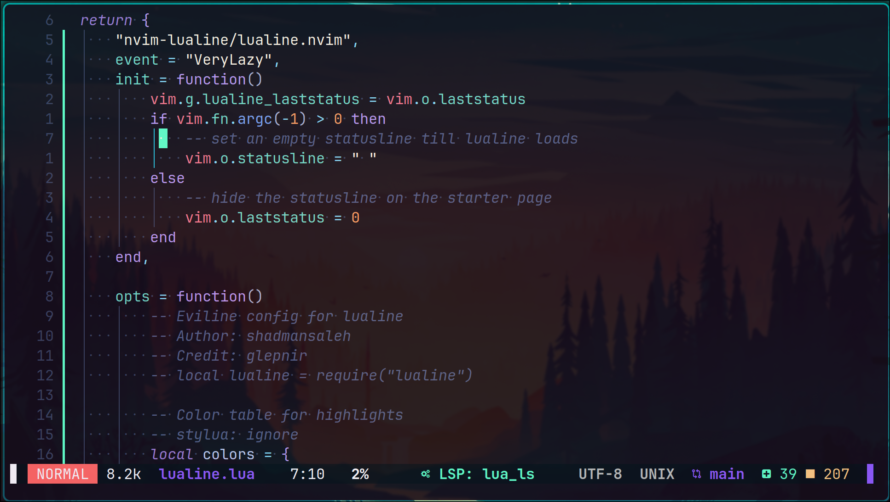

# Neovim configuration

<kbd></kbd>

A [Lazy](https://github.com/folke/lazy.nvim) and [Mason](https://github.com/williamboman/mason.nvim) based [Neovim](https://neovim.io/) configuration with [LSP](https://github.com/neovim/nvim-lspconfig) and [DAP](https://github.com/mfussenegger/nvim-dap) support for:

Language | 📰 LSP | 🪲 DAP
--: | :-: | :-:
Rust |  ✔️ | ✔️
C\C++ |  ✔️ | ✔️
Python |  ✔️ | ✔️
Lua |  ✔️ | ✔️
Bash |  ✔️ | ✖️
Json |  ✔️ | ✖️
Markdown |  ✔️ | ✖️

## 💾 Installation

Install mandatory dependencies and clone the repository:

```sh
pacman -S fd ripgrep zip npm python-pip
git clone https://github.com/tonigineer/nvim.git ~/.config/nvim
```

## 🔧 Dependencies

In order to make `:checkhealth` completely happy, additional dependencies and setup steps are needed:

```sh
yay -S julia-bin luarocks python-neovim-git
rustup default stable

# Treesitter executable
sudo pacman -S yarn
yarn global add tree-sitter-cli
cargo install tree-sitter-cli
sudo npm install -g tree-sitter-cli
```

<details>
    
<summary>Install Neovim on Ubuntu</summary>


```sh
# Neovim for Ubuntu
sudo apt install build-essential tar wget
wget https://github.com/neovim/neovim/releases/download/stable/nvim-linux64.tar.gz
tar -xf ~/nvim-linux64.tar.gz
sudo mkdir /opt/nvim && -r nvim-linux64 /opt/nvim
sudo ln -s /opt/nvim/bin/nvim /usr/bin/nvim
rm -rf nvim-linux64*
```


</details>

